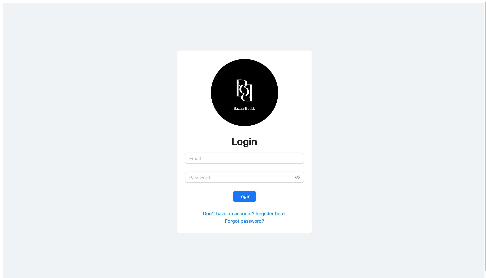
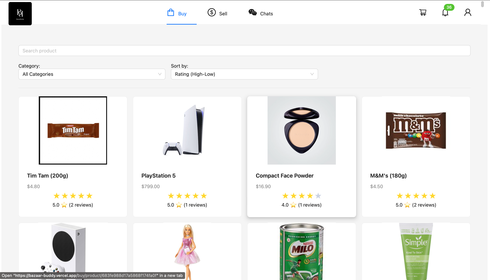
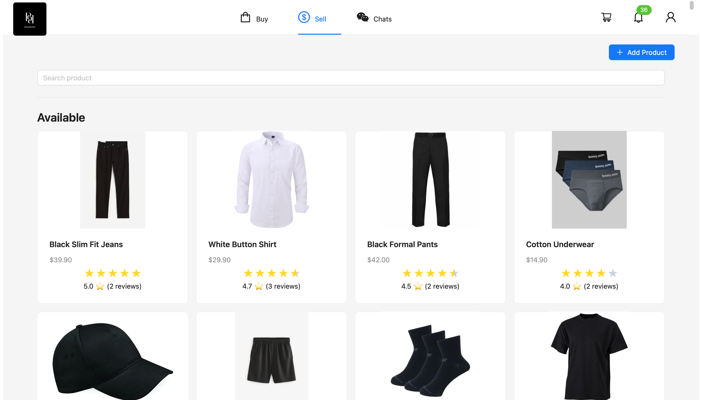

# BazaarBuddy

**BazaarBuddy** is a full-stack online marketplace platform where users can buy and sell products, communicate via real-time chat, receive real-time notifications, and make secure payments — all in one place.

## Live Demo

[Visit BazaarBuddy](https://bazaar-buddy.vercel.app)

This demo is fully functional and runs on Stripe's test mode. You can simulate a purchase using Stripe's test card: `4242 4242 4242 4242` (Any future date, any CVC).

## Screenshots

### Login Page

### Browse Products

### Manage Listings

## Features at a Glance

- Browse, search, and filter product listings
- List items for sale with images
- Real-time chat between users (e.g., inquiries or order discussions)
- Instant in-app notifications (e.g., order placed, shipped, reviewed)
- Secure Stripe payments and seller payouts
- User authentication
- Responsive and modern UI with Ant Design

## Tech Stack

**Frontend**

- React
- Ant Design (UI component library)
- Firebase Authentication
- Firebase Storage (Image uploads)
- Axios
- Socket.IO Client

**Backend**

- Node.js + Express
- MongoDB + Mongoose
- Stripe (Payments)
- Socket.IO (Real-time chat & notifications)

**Deployment**

- Vercel (Frontend)
- Render (Backend)
- MongoDB Atlas (Database)

---

## Local Setup

If you'd like to run the app locally (e.g., for development or testing), follow the guide here:  
📄 [SETUP.md](./SETUP.md)

---
