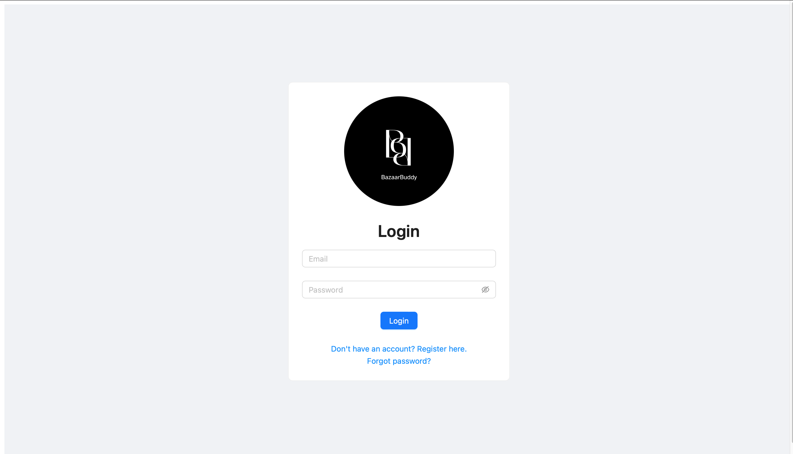
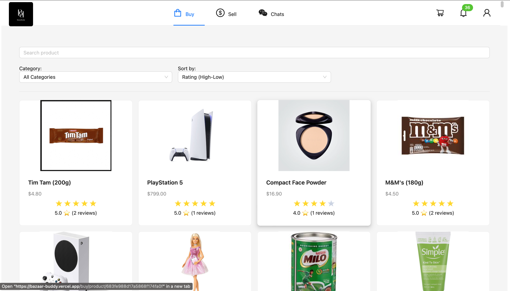
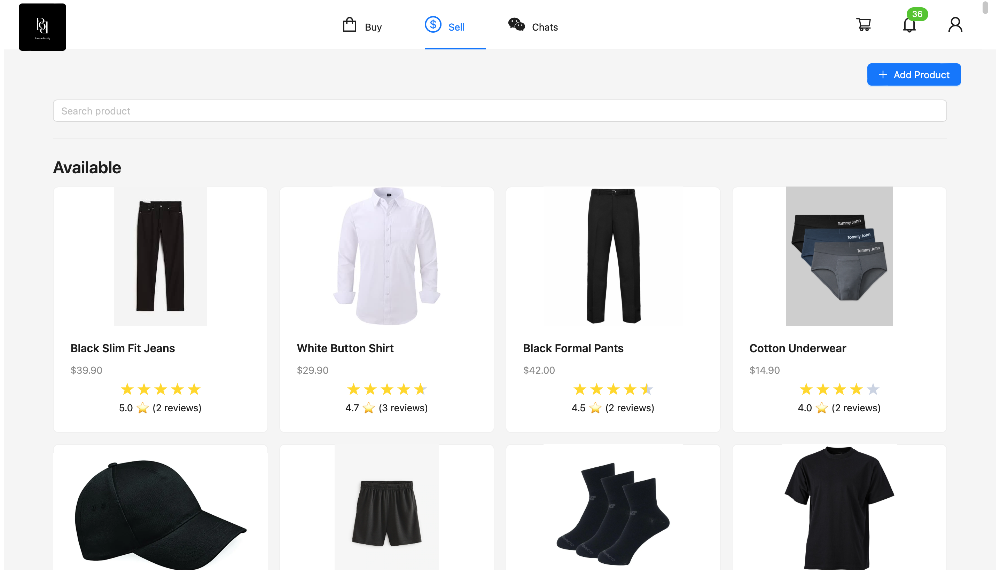

# BazaarBuddy

**BazaarBuddy** is a full-stack online marketplace platform where users can buy and sell products, communicate via real-time chat, receive real-time notifications, and make secure payments — all in one place.

## Live Demo

[Visit BazaarBuddy](https://bazaar-buddy.vercel.app)

This demo is fully functional and runs on Stripe's test mode. You can simulate a purchase using Stripe's test card: `4242 4242 4242 4242` (Any future date, any CVC).

## Screenshots

### Login Page

### Browse Products

### Manage Listings

## Features at a Glance

- Browse, search, and filter product listings
- List items for sale with automated image uploading
- **✨ Intelligent Async AI Categorization**: Users submit listings without manual tags; an automated background worker uses Gemini to accurately classify items dynamically.
- Real-time chat between users (e.g., inquiries or order discussions)
- Instant in-app notifications (e.g., order placed, shipped, reviewed)
- Secure Stripe payments and seller payouts
- User authentication
- Responsive and modern UI with Ant Design

## Architecture Layer: Asynchronous AI Pipeline

To prevent slow LLM API response times from blocking the core server thread, BazaarBuddy utilizes an event-driven background processing architecture:

1. **Submission**: When a seller lists an item, it is immediately saved to MongoDB with an `isCategorized: false` state.
2. **Queueing**: The Express controller pushes a background job containing the listing metadata onto a **BullMQ** queue managed by a high-performance **Render Key Value (Redis)** instance.
3. **Execution**: An isolated worker process picks up the task via a low-latency internal network connection, queries **Gemini 2.5 Flash** using a strict JSON structural schema constraint, updates the product category, and toggles `isCategorized: true`.
4. **UI Presentation**: The frontend checks this state to display elegant, non-blocking loading skeletons, preventing user disruption while processing occurs seamlessly behind the scenes.

## Tech Stack

**Frontend**

- React
- Ant Design (UI component library)
- Supabase Authentication
- Supabase Storage (Image uploads)
- Axios
- Socket.IO Client

**Backend**

- Node.js + Express
- MongoDB + Mongoose
- **BullMQ** (Background job framework)
- **@google/genai** (Gemini 2.5 Flash Integration)
- Stripe (Payments)
- Socket.IO (Real-time chat & notifications)

**Infrastructure / Deployment**

- Vercel (Frontend)
- Render (Backend Web Service)
- **Render Key Value** (Managed Redis instance linked via internal private network)
- MongoDB Atlas (Cloud Database)

---

## Local Setup

If you'd like to run the app locally (e.g., for development or testing), follow the guide here:  
📄 [SETUP.md](./SETUP.md)
